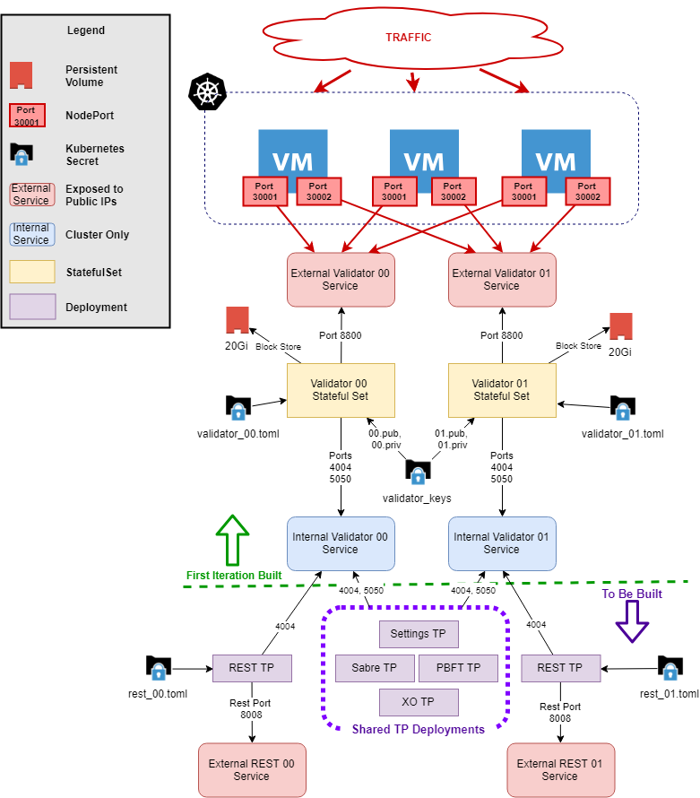

# Sawtooth on Kubernetes

## Intent

The intention behind using k8s to manage sawtooth deployment is ease of operational manageability, scalability, and containerization. Kubernetes will provide auto-scaling of deployments to improve 

## Planned Architecture

### Notes

- Transaction processors bind to the validator on port 4004
- PBFT will bind to the validator on port 5050 (default consensus port)
- [Running on Sawtooth Kubernetes guide](https://sawtooth.hyperledger.org/docs/core/releases/latest/app_developers_guide/kubernetes.html)
  - [sawtooth-kubernetes-default.yaml](https://sawtooth.hyperledger.org/docs/core/releases/latest/app_developers_guide/sawtooth-kubernetes-default.yaml)
- [Running Sawtooth on Docker guide](https://sawtooth.hyperledger.org/docs/core/releases/1.0/app_developers_guide/docker.html)
  - [Sample docker compose](https://sawtooth.hyperledger.org/docs/core/releases/1.0/app_developers_guide/sawtooth-default.yaml)
  - [Sample docker compose multiple validators & POET consensus](https://github.com/hyperledger/sawtooth-core/blob/master/docker/compose/sawtooth-default-poet.yaml)
- REST Exposed Services will use Ingress application load balancer

## Open Items
1. What container hosts CLI interactions? Does each transaction processor container host its CLI component?
2. How to integrate https://hub.docker.com/r/hyperledger/sawtooth-shell/ for CLI interactions
3. Should we build a RESTful interface for submitting CLI interactions?
4. For the shared transaction processor services, investigate the need to have a shared validator internal service for the deployments to connect to or if the tp's entrypoints may have multiple --bind arguments.

## Enhancements
1. Change NodePort exposure to NLB